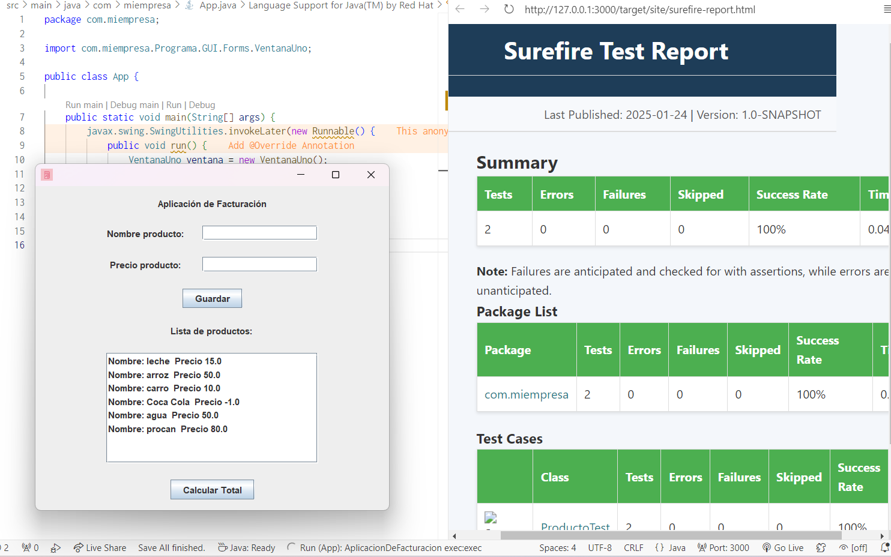

### Aplicacion de Facturacion con Interfaz grafica

Permita gestionar productos en una tienda. La interfaz debe tener las siguientes funcionalidades:

* Un campo de texto para ingresar el nombre del producto.
* Un campo de texto para ingresar el precio del producto.
* Un botón para agregar el producto a la lista de productos.
* Un área de texto que muestre la lista de productos agregados.
* Un botón para calcular el total de la factura.

